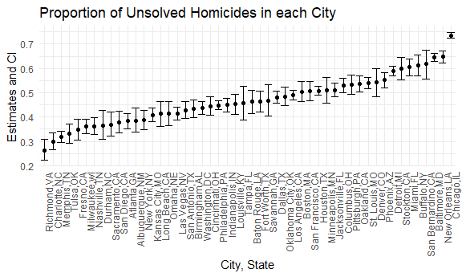
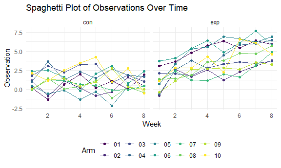

p8105_hw5_sjk2254
================
Sharon Kulali

``` r
# loading the needed packages

library(tidyverse)

knitr::opts_chunk$set(
  fig.width = 6,
  fig.asp = .6,
  out.width = "90%"
)

theme_set(theme_minimal() + theme(legend.position = "bottom"))

options(
  ggplot2.continuous.colour = "viridis",
  ggplot2.continuous.fill = "viridis"
)

scale_colour_discrete = scale_colour_viridis_d
scale_fill_discrete = scale_fill_viridis_d
```

# Problem 1

``` r
# importing and cleaning the data

homicides_df = 
  read_csv("data/homicide-data.csv", na = c("", "NA", "Unknown")) |> 
  mutate(city_state = paste(city, state, sep = ","),
         resolution = case_when(
          disposition == "Closed without arrest" ~ "unsolved",
          disposition == "Open/No arrest"        ~ "unsolved",
          disposition == "Closed by arrest"      ~ "solved")) |> 
  filter(city_state != "Tulsa,AL") |> 
  separate(reported_date, into = c("year", "month", "day"), sep = c(4, 6))
```

    ## Rows: 52179 Columns: 12
    ## ── Column specification ────────────────────────────────────────────────────────
    ## Delimiter: ","
    ## chr (8): uid, victim_last, victim_first, victim_race, victim_sex, city, stat...
    ## dbl (4): reported_date, victim_age, lat, lon
    ## 
    ## ℹ Use `spec()` to retrieve the full column specification for this data.
    ## ℹ Specify the column types or set `show_col_types = FALSE` to quiet this message.

``` r
# total number of homicides

homicides_df |>
  group_by(city) |> 
  summarise(count = n())
```

    ## # A tibble: 50 × 2
    ##    city        count
    ##    <chr>       <int>
    ##  1 Albuquerque   378
    ##  2 Atlanta       973
    ##  3 Baltimore    2827
    ##  4 Baton Rouge   424
    ##  5 Birmingham    800
    ##  6 Boston        614
    ##  7 Buffalo       521
    ##  8 Charlotte     687
    ##  9 Chicago      5535
    ## 10 Cincinnati    694
    ## # ℹ 40 more rows

``` r
# number of unsolved homicides

homicides_df |>
  filter(disposition %in% c("Closed without arrest", "Open/No arrest")) |> 
  group_by(city) |> 
  summarise(unsolved_count = n())
```

    ## # A tibble: 50 × 2
    ##    city        unsolved_count
    ##    <chr>                <int>
    ##  1 Albuquerque            146
    ##  2 Atlanta                373
    ##  3 Baltimore             1825
    ##  4 Baton Rouge            196
    ##  5 Birmingham             347
    ##  6 Boston                 310
    ##  7 Buffalo                319
    ##  8 Charlotte              206
    ##  9 Chicago               4073
    ## 10 Cincinnati             309
    ## # ℹ 40 more rows

``` r
homicides_df |>
  filter(disposition %in% c("Closed without arrest", "Open/No arrest")) |> 
  group_by(city) |> 
  summarise(unsolved_count = n()) |> 
  pull(unsolved_count) |> 
  sum()
```

    ## [1] 26505

``` r
# total number of homicides and the number that are solved

city_homicide_df = 
  homicides_df |>  
  select(city_state, disposition, resolution) |> 
  group_by(city_state) |> 
  summarize(
    hom_total = n(),
    hom_unsolved = sum(resolution == "unsolved"))
```

The Washington Post has data on homicides over the past decade in 50 of
the largest American cities. The `homicides_df` has information on the
location of the killings, whether an arrest was made, and basic
demographic information about each victim. The `homicides_df` data has
52178 observations and 16 variables with information from years 2007 to
2017. An average victim is White, 32 years old, and Male.

``` r
# number of unsolved homicides in Baltimore

homicides_df |>
  filter(city == "Baltimore") |> 
  summarise(count = n())
```

    ## # A tibble: 1 × 1
    ##   count
    ##   <int>
    ## 1  2827

``` r
homicides_df |> 
  filter(city == "Baltimore",
         disposition %in% c("Closed without arrest", "Open/No arrest")) |> 
  summarise(unsolved_count = n())
```

    ## # A tibble: 1 × 1
    ##   unsolved_count
    ##            <int>
    ## 1           1825

``` r
# proportion of homicides that are unsolved in Baltimore

prop.test(x = 1825, n = 2827) |> 
  broom::tidy() |> 
  select(estimate, conf.low, conf.high)
```

    ## # A tibble: 1 × 3
    ##   estimate conf.low conf.high
    ##      <dbl>    <dbl>     <dbl>
    ## 1    0.646    0.628     0.663

``` r
# creating a function to estimate the proportion of homicides that are unsolved

test_results = 
  city_homicide_df |>
  mutate(
    prop_tests = map2(hom_unsolved, hom_total, \(x, y) prop.test(x = x, n = y)),
    tidy_tests = map(prop_tests, broom::tidy)) |> 
  select(-prop_tests) |>  
  unnest(tidy_tests) |>  
  select(city_state, estimate, conf.low, conf.high) |> 
  mutate(city_state = fct_reorder(city_state, estimate))

# plot that shows the estimates and CIs for each city

test_results |> 
  mutate(city_state = fct_reorder(city_state, estimate)) |> 
  ggplot(aes(x = city_state, y = estimate)) + 
  geom_point() + 
  geom_errorbar(aes(ymin = conf.low, ymax = conf.high)) + 
  theme(axis.text.x = element_text(angle = 90, hjust = 1)) +
  labs(title = "Proportion of Unsolved Homicides in each City",
       x = "City, State",
       y = "Estimates and CI")
```



The plot above shows the proportion of unsolved homicides in each city.
It appears that there is a very wide range in the rate at which
homicides are solved. Noticeably, Chicago has the highest estimates and
given it has the narrowst CI, it can be concluded that it has the
highest rates of homicides. Tampa has an estimate closer to 0.45 with a
wider CI which might indicate that homicides are less frequent. Lastly,
Richmond has the lowest estimate around 0.20.

# Problem 2

``` r
# all the file names

file_names = list.files(path = "data", pattern = "con|exp", full.names = TRUE)

# extracting information from the files

data = 
  file_names |> 
  purrr::map(~ read.csv(.x) |> 
  mutate(subject_id = str_extract(.x, "\\d+"),
         arm = str_extract(.x, "con|exp"))) |> 
  bind_rows() |> 
  pivot_longer(cols = starts_with("week_"), 
               names_to = "week", 
               values_to = "observation")|> 
  mutate(week = str_replace(week, "week_", ""),
         week = as.numeric(week))
```

``` r
# creating a spaghetti plot showing observations of each subject over time

data |> 
  group_by(arm) |> 
  ggplot(aes(x = week, y = observation, color = subject_id)) +
  geom_line() +
  geom_point() +
  facet_grid(.~arm) +
  labs(title = "Spaghetti Plot of Observations Over Time",
       x = "Week",
       y = "Observation",
       color = "Arm")
```



The spaghetti plot above shows the observations of each subject over the
weeks between the control and experimental arm. You can see that in the
control arm, observations stayed relatively consistent throughout the
weeks for each subject. Additionally, some of the observation values go
into the negative. While in the experimental arm, the observations
increased throughout the weeks for each subject and apart from the first
week, all the observation values stay in positives.

# Problem 3

``` r
# making a function that obtains the estimate and p-value 

set.seed(123)

ttest_function = function(n = 30, mu = 0, sigma = 5) {
  
  sim_data = 
    tibble(x = rnorm(n, mean = mu, sd = sigma))
  
  test = t.test(x ~ 1, data = sim_data) |> 
    broom::tidy() |> 
    select(estimate, p.value)
  
  return(test)
}
```

``` r
# making a dataframe that obtains the estimate and p-value for 5000 simulations

sim_results_df = 
  tibble(mu = 0:6) |> 
  mutate(
    output_df = map(mu, ~rerun(5000, ttest_function(n = 30, mu = .x))),
    estimate_df = map(output_df, bind_rows)
  ) |> 
  select(-output_df)
```

    ## Warning: There was 1 warning in `mutate()`.
    ## ℹ In argument: `output_df = map(mu, ~rerun(5000, ttest_function(n = 30, mu =
    ##   .x)))`.
    ## Caused by warning:
    ## ! `rerun()` was deprecated in purrr 1.0.0.
    ## ℹ Please use `map()` instead.
    ##   # Previously
    ##   rerun(5000, ttest_function(n = 30, mu = .x))
    ## 
    ##   # Now
    ##   map(1:5000, ~ ttest_function(n = 30, mu = .x))

``` r
# plot showing the proportion of times the null was rejected

sim_results_df |> 
  unnest(estimate_df) |> 
  group_by(mu) |> 
  summarise(power = mean(p.value < 0.05)) |> 
  ggplot(aes(x = mu, y = power)) + 
  geom_line() +
  geom_point() +
  labs(title = "Power of the Test",
       x = "True μ",
       y = "Proportion of Rejections",
       color = "Arm")
```


The plot above shows the proportion of times the null was rejected,
power, compared to the true value of mu. You can see that as the power
of the test increases, so does the true value of mu. Additionally, the
variability of the effect size increases as you increase power. With a
mu from 0 to 4, there is a rapid increase then it levels out for mu from
4 to 6.

``` r
# plot showing average estimate of mu compared to the the true value of mu

average_estimate_all = 
  sim_results_df |> 
  unnest(estimate_df) |> 
  group_by(mu) |>  
  summarize(average_estimate = mean(estimate))

ggplot(average_estimate_all, aes(x = mu, y = average_estimate)) +
  geom_path() +
  geom_point() +
  labs(title = "Average Estimate of μ",
       x = "True μ",
       y = "Average Estimate",
       color = "Arm")
```


``` r
# plot showing average estimate of mu compared to the the true value of mu when null was rejected

average_estimate_rejected = 
  sim_results_df |> 
  unnest(estimate_df) |> 
  filter(p.value < 0.05) |> 
  group_by(mu) |> 
  summarize(average_estimate_rejected = mean(estimate))

ggplot() +
  geom_line(data = average_estimate_all, aes(x = mu, y = average_estimate), color = "black") +
  geom_point(data = average_estimate_all, aes(x = mu, y = average_estimate), color = "black") +
  geom_line(data = average_estimate_rejected, aes(x = mu, y = average_estimate_rejected), color = "red") +
  geom_point(data = average_estimate_rejected, aes(x = mu, y = average_estimate_rejected), color = "red") +
  labs(title = "Average Estimate of μ (All and Rejected Samples)",
       x = "True μ",
       y = "Average Estimate",
       color = "Arm")
```


The first plot shows the average estimate of mu compared to the true
value of mu. You can see that as the average estimate increase, so does
the true mu. There is a positive, linear relationship. The second plot
shows the average estimate of mu in samples where the null was rejected
(red line) and for all (black line) compared to the true value of mu. In
the rejected samples, there appears to be a right skewed distribution of
the line. For smaller values of the true mu, there is less of a linear
relationship compared to higher values of the true mu where you can
clearly see a positive, linear relationship. More specifically, the
sample average of mu across tests for which the null is rejected isn’t
equal to the true value of mu for smaller values of the average estimate
and true mu but it is for larger values of true mu and average estimate.
The higher your estimate, the closer you are to predicting the true mu
in your samples.
