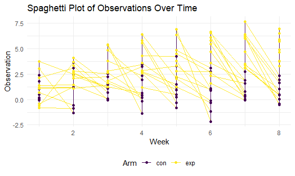
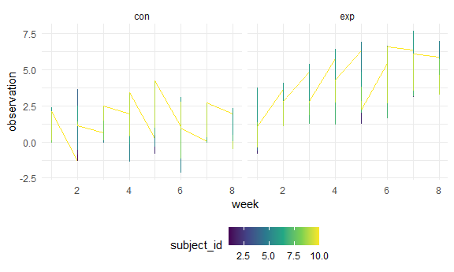
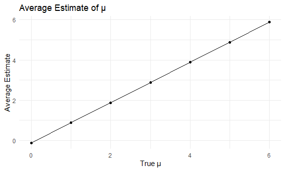
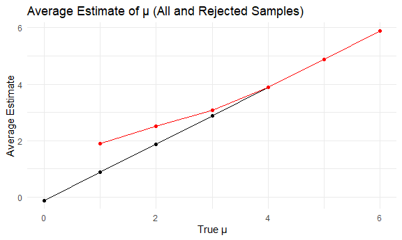

p8105_hw5_sjk2254
================
Sharon Kulali

``` r
# loading the needed packages

library(tidyverse)
```

    ## ── Attaching core tidyverse packages ──────────────────────── tidyverse 2.0.0 ──
    ## ✔ dplyr     1.1.3     ✔ readr     2.1.4
    ## ✔ forcats   1.0.0     ✔ stringr   1.5.0
    ## ✔ ggplot2   3.4.3     ✔ tibble    3.2.1
    ## ✔ lubridate 1.9.2     ✔ tidyr     1.3.0
    ## ✔ purrr     1.0.2     
    ## ── Conflicts ────────────────────────────────────────── tidyverse_conflicts() ──
    ## ✖ dplyr::filter() masks stats::filter()
    ## ✖ dplyr::lag()    masks stats::lag()
    ## ℹ Use the conflicted package (<http://conflicted.r-lib.org/>) to force all conflicts to become errors

``` r
knitr::opts_chunk$set(
  fig.width = 6,
  fig.asp = .6,
  out.width = "90%"
)

theme_set(theme_minimal() + theme(legend.position = "bottom"))

options(
  ggplot2.continuous.colour = "viridis",
  ggplot2.continuous.fill = "viridis"
)

scale_colour_discrete = scale_colour_viridis_d
scale_fill_discrete = scale_fill_viridis_d
```

# Problem 1

``` r
# importing the data

homicides_df = 
  read_csv("data/homicide-data.csv") |> 
  mutate(city_state = paste(city, state, sep = ",")) 
```

    ## Rows: 52179 Columns: 12
    ## ── Column specification ────────────────────────────────────────────────────────
    ## Delimiter: ","
    ## chr (9): uid, victim_last, victim_first, victim_race, victim_age, victim_sex...
    ## dbl (3): reported_date, lat, lon
    ## 
    ## ℹ Use `spec()` to retrieve the full column specification for this data.
    ## ℹ Specify the column types or set `show_col_types = FALSE` to quiet this message.

``` r
# total number of homicides

homicides_df |>
  group_by(city) |> 
  summarise(count = n())
```

    ## # A tibble: 50 × 2
    ##    city        count
    ##    <chr>       <int>
    ##  1 Albuquerque   378
    ##  2 Atlanta       973
    ##  3 Baltimore    2827
    ##  4 Baton Rouge   424
    ##  5 Birmingham    800
    ##  6 Boston        614
    ##  7 Buffalo       521
    ##  8 Charlotte     687
    ##  9 Chicago      5535
    ## 10 Cincinnati    694
    ## # ℹ 40 more rows

``` r
# number of unsolved homicides

homicides_df |>
  filter(disposition %in% c("Closed without arrest", "Open/No arrest")) |> 
  group_by(city) |> 
  summarise(unsolved_count = n())
```

    ## # A tibble: 50 × 2
    ##    city        unsolved_count
    ##    <chr>                <int>
    ##  1 Albuquerque            146
    ##  2 Atlanta                373
    ##  3 Baltimore             1825
    ##  4 Baton Rouge            196
    ##  5 Birmingham             347
    ##  6 Boston                 310
    ##  7 Buffalo                319
    ##  8 Charlotte              206
    ##  9 Chicago               4073
    ## 10 Cincinnati             309
    ## # ℹ 40 more rows

``` r
homicides_df |>
  filter(disposition %in% c("Closed without arrest", "Open/No arrest")) |> 
  group_by(city) |> 
  summarise(unsolved_count = n()) |> 
  pull(unsolved_count) |> 
  sum()
```

    ## [1] 26505

``` r
# number of unsolved homicides in Baltimore

homicides_df |>
  filter(city == "Baltimore") |> 
  summarise(count = n())
```

    ## # A tibble: 1 × 1
    ##   count
    ##   <int>
    ## 1  2827

``` r
homicides_df |> 
  filter(city == "Baltimore",
         disposition %in% c("Closed without arrest", "Open/No arrest")) |> 
  summarise(unsolved_count = n())
```

    ## # A tibble: 1 × 1
    ##   unsolved_count
    ##            <int>
    ## 1           1825

``` r
bpt =
  prop.test(x = 1825, n = 2827) |> 
  broom::tidy() |> 
  select(estimate, conf.low, conf.high)
```

# Problem 2

``` r
# all the file names

file_names = list.files(path = "data", pattern = "con|exp", full.names = TRUE)

# extracting information from the files

data = 
  file_names |> 
  purrr::map(~ read.csv(.x) |> 
  mutate(subject_id = str_extract(.x, "\\d+"),
         arm = str_extract(.x, "con|exp"))) |> 
  bind_rows() |> 
  pivot_longer(cols = starts_with("week_"), 
               names_to = "week", 
               values_to = "observation")|> 
  mutate(week = str_replace(week, "week_", ""),
         week = as.numeric(week),
         subject_id = as.numeric(subject_id))
```

``` r
# creating a spaghetti plot showing observations of each subject over time

ggplot(data, aes(x = week, y = observation, group = subject_id, color = arm)) +
  geom_line() +
  geom_point() +
  labs(title = "Spaghetti Plot of Observations Over Time",
       x = "Week",
       y = "Observation",
       color = "Arm")
```



``` r
data |> 
  group_by(arm) |> 
  ggplot(aes(x = week, y = observation, color = subject_id)) +
  geom_line() +
  facet_grid(.~arm)
```



# Problem 3

``` r
# function that obtains the estimate and p-value 5 times

simulate_t_test = function(mu, n = 30, sigma = 5, alpha = 0.05, num_simulations = 5) {
  set.seed(123)

  estimates = numeric(num_simulations)
  p_values = numeric(num_simulations)
  
  for (i in 1:num_simulations) {
    data = rnorm(n, mean = mu, sd = sigma)
    t_test_result = broom::tidy(t.test(data, mu = 0, alternative = "two.sided"))
    
    estimates[i] = t_test_result$estimate
    p_values[i] = t_test_result$p.value
  }
  
  result_df = data.frame(mu = mu, estimate = estimates, p_value = p_values)
  return(result_df)
}

mu_values = 0:6

simulation_results = data.frame()

for (mu_val in mu_values) {
  result = simulate_t_test(mu = mu_val)
  simulation_results = bind_rows(simulation_results, result)
}

head(simulation_results)
```

    ##   mu   estimate   p_value
    ## 1  0 -0.2355188 0.7944204
    ## 2  0  0.8916917 0.2516694
    ## 3  0  0.1221020 0.8788492
    ## 4  0 -0.4694447 0.5750370
    ## 5  0 -0.9179020 0.3884876
    ## 6  1  0.7644812 0.4003008

``` r
summary(simulation_results)
```

    ##        mu       estimate          p_value         
    ##  Min.   :0   Min.   :-0.9179   Min.   :0.0000000  
    ##  1st Qu.:1   1st Qu.: 1.1021   1st Qu.:0.0000127  
    ##  Median :3   Median : 2.8917   Median :0.0044221  
    ##  Mean   :3   Mean   : 2.8782   Mean   :0.1563187  
    ##  3rd Qu.:5   3rd Qu.: 4.6475   3rd Qu.:0.2099539  
    ##  Max.   :6   Max.   : 6.8917   Max.   :0.9381217

``` r
# function that obtains the estimate and p-value 5 times

simulate_t_test = function(mu, n = 30, sigma = 5, alpha = 0.05, num_simulations = 5000) {
  set.seed(123)

  estimates = numeric(num_simulations)
  p_values = numeric(num_simulations)
  
  for (i in 1:num_simulations) {
    data = rnorm(n, mean = mu, sd = sigma)
    t_test_result = broom::tidy(t.test(data, mu = 0, alternative = "two.sided"))
    
    estimates[i] = t_test_result$estimate
    p_values[i] = t_test_result$p.value
  }
  
  result_df = data.frame(mu = mu, estimate = estimates, p_value = p_values)
  return(result_df)
}

mu_values = c(0, 1, 2, 3, 4, 5, 6)

simulation_results = data.frame()

for (mu_val in mu_values) {
  result = simulate_t_test(mu = mu_val)
  simulation_results = bind_rows(simulation_results, result)
}

head(simulation_results)
summary(simulation_results)
```

``` r
# plot showing the proportion of times the null was rejected

power_data = simulation_results |> 
  group_by(mu) |> 
  summarize(power = mean(p_value < 0.05))

ggplot(power_data, aes(x = mu, y = power)) +
  geom_line() +
  geom_point() +
  labs(title = "Power of the Test",
       x = "True μ",
       y = "Proportion of Rejections",
       color = "Arm")
```

``` r
# plot showing average estimate of mu compared to the the true value of mu

average_estimate_all = 
  simulation_results |> 
  group_by(mu) |> 
  summarize(average_estimate = mean(estimate))

ggplot(average_estimate_all, aes(x = mu, y = average_estimate)) +
  geom_line() +
  geom_point() +
  labs(title = "Average Estimate of μ",
       x = "True μ",
       y = "Average Estimate",
       color = "Arm")
```



``` r
# plot showing average estimate of mu compared to the the true value of mu when null was rejected

average_estimate_rejected = 
  simulation_results |> 
  filter(p_value < 0.05) |> 
  group_by(mu) |> 
  summarize(average_estimate_rejected = mean(estimate))

ggplot() +
  geom_line(data = average_estimate_all, aes(x = mu, y = average_estimate), color = "black") +
  geom_point(data = average_estimate_all, aes(x = mu, y = average_estimate), color = "black") +
  geom_line(data = average_estimate_rejected, aes(x = mu, y = average_estimate_rejected), color = "red") +
  geom_point(data = average_estimate_rejected, aes(x = mu, y = average_estimate_rejected), color = "red") +
  labs(title = "Average Estimate of μ (All and Rejected Samples)",
       x = "True μ",
       y = "Average Estimate",
       color = "Arm")
```


